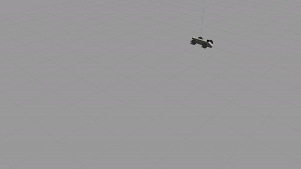

# Windrunner
Windrunner is a model car with Ackermann steering. This was an exercise on bringing CAD models into a physics simulator like Gazebo and further integrating ROS controllers to operate the vehicle. This was my first project for the [ENPM662 (Introduction to Robot Modeling)](https://app.testudo.umd.edu/soc/search?courseId=ENPM662&sectionId=&termId=202308&_openSectionsOnly=on&creditCompare=&credits=&courseLevelFilter=ALL&instructor=&_facetoface=on&_blended=on&_online=on&courseStartCompare=&courseStartHour=&courseStartMin=&courseStartAM=&courseEndHour=&courseEndMin=&courseEndAM=&teachingCenter=ALL&_classDay1=on&_classDay2=on&_classDay3=on&_classDay4=on&_classDay5=on) course in the Fall 2022 semester.

<p align="center"></p>

## Description of contents
`cad/` consists of the Solidworks part and assembly files of the robot and tool plus Blender files of the same to export in DAE file format for the meshes.

`dockerfile/` consists of the necessary files to build the Docker image of this project. The image can then be used to run the container as an executable for simulating in Gazebo. Building the Docker image locally is not recommended, an up-to-date image is available on [Docker Hub](https://hub.docker.com/r/armdocks/windrunner).

`image/` just consists of the GIF image used on the README page.

`windrunner/` is the ROS package for the Windrunner model car.

## Running the project
This project can only run on Linux at the moment in two ways:
### In Docker container (Recommended)
This is the easiest, most convenient way to run the project demo as an executable. Docker (Linux) installation is required, to install refer the [documentation](https://docs.docker.com/engine/install/).

Pull the Docker image of this project from Docker Hub.
```
docker pull armdocks/windrunner
```

Run the container for running the Gazebo simulation.
```
docker run -it -e DISPLAY=$DISPLAY -v /tmp/.X11-unix:/tmp/.X11-unix armdocks/windrunner
```
>**Tip:** The -it argument can be omitted from the above command for a less verbose, clean terminal output.

>**Note:** The simulation might lag when the Gazebo window opens maximized, shrink the window to improve frame rate.

### On local machine
This requires Ubuntu Focal (20.04) with ROS Noetic full desktop installation. Additional ROS packages that might be required are [joint state](http://wiki.ros.org/joint_state_controller) and [effort](http://wiki.ros.org/effort_controllers) controller packages and the [PyYAML](https://pypi.org/project/PyYAML/) Python package.

These additional packages can be installed by:

Joint state controllers package
```
apt install ros-noetic-joint-state-controller
```
Effort controllers package
```
apt install ros-noetic-effort-controllers
```
PyYAML package
```
pip3 install pyyaml
```
Assuming you have the catkin workspace setup, 

Clone the repository to `src/` folder of the target catkin workpace. Assuming this would be `~/catkin_ws/src/`,
```
git clone https://github.com/armgits/windrunner.git ~/catkin_ws/src/windrunner_project
```
Make the Python files `start.py` and `move.py` in the `src/` folder of windrunner package executable.
```
sudo chmod +x ~/catkin_ws/src/windrunner_project/windrunner/src/windrunner_publisher.py
sudo chmod +x ~/catkin_ws/src/windrunner_project/windrunner/src/windrunner_teleop.py
```
Now you can build and source the packages.

After a successful build, run the simulation in Gazebo. 

This can be done in a single line using the shell script `windrunner_circle.sh` or `windrunner_teleop.sh` from `dockerfile/` folder.

#### Demo for moving in a circular path (As seen in GIF)
```
~/catkin_ws/src/windrunner_project/dockerfile/windrunner_circle.sh
```
#### Teleoperation using keyboard input
```
~/catkin_ws/src/windrunner_project/dockerfile/windrunner_teleop.sh
```
Or manually,

In first terminal initialize the ROS master.
```
roscore
```
#### Demo for moving in a circular path
In a new, second terminal spawn the robot in Gazebo.
```
roslaunch windrunner windrunner_empty_world.launch
```
In a new, third terminal run the node to perform the task.
```
rosrun windrunner windrunner_publisher.py
```
#### For teleoperation using keyboard input
In a new, second terminal spawn the robot in Gazebo.
```
roslaunch windrunner windrunner.launch
```
In a new, third terminal run the node to perform the task.
```
rosrun windrunner windrunner_teleop.py
```

